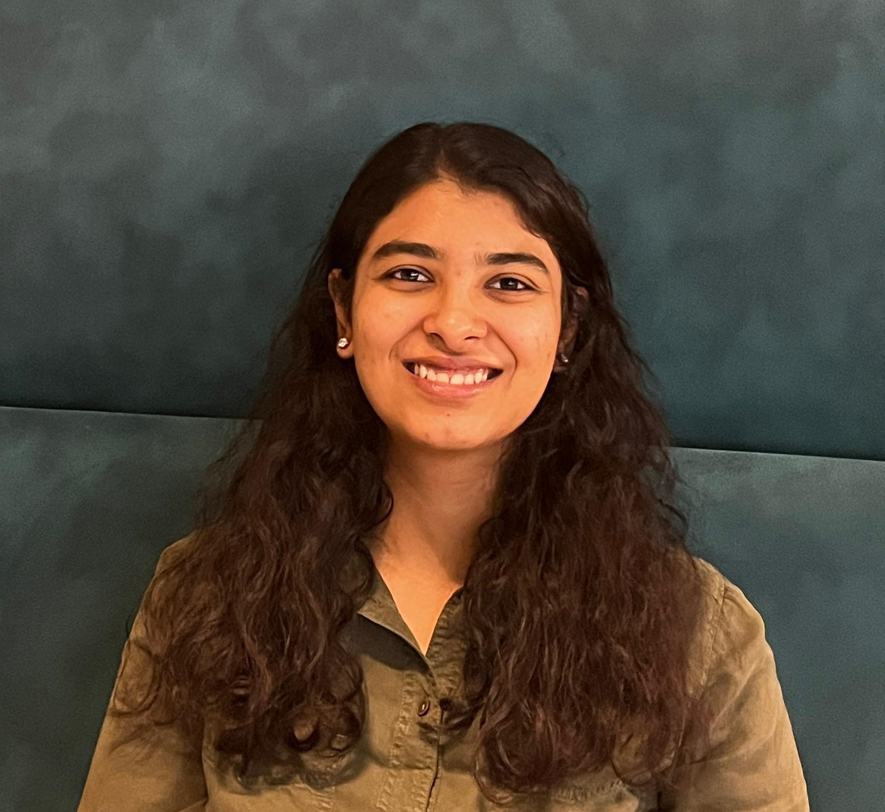

  
  

    <h1 style="margin-bottom: 0;">Rishika Agarwal</h1>
    
MSc Business Analytics | Python, SQL, Tableau | Business Analyst Enthusiast

    
<strong>Actively seeking roles as a Business Analyst, Data Analyst, or Pricing Analyst</strong>

    

      <a href="/Rishika Agarwal CV .pdf" class="btn" target="_blank">CV</a>
      <a href="https://www.linkedin.com/in/rishika-agarwal-uk" class="btn" target="_blank">LinkedIn</a>
      <a href="https://github.com/RishikaAgarwal2025/Business-Analysis-Portfolio" class="btn" target="_blank">GitHub</a>
      <a href="mailto:rishikaagarwal544@gmail.com" class="btn" target="_blank">Email</a>
    

  

---

### 👋 Welcome!

When I first discovered how a few lines of Python could automate hours of manual work, I knew I had found my path. Since then, I’ve been driven by one question: how can data drive smarter, more impactful business decisions?

I’m Rishika Agarwal, a Distinction graduate in MSc Business Analytics from the University of Warwick, with a strong foundation in Economics and Mathematics. I bring hands-on experience in Python, SQL, and Tableau, and a proven ability to transform complex, messy data into actionable business insights.

I am actively seeking entry-level opportunities as a Business Analyst, or Data Analyst, where I can apply analytical thinking, technical skills, and structured problem-solving to real-world business challenges.

My work reflects a strong blend of analytical rigor and real-world impact. I am converting my undergraduate dissertation into a conference paper, “Enhancing Efficiency and Societal Impact of Ahmedabad’s BRTS: Interventions and Innovations”, where I applied data-driven analysis to improve public transport efficiency and societal outcomes. I am also currently collaborating with Dr. Anand Jacob Abraham (IIT) on a conference research paper, strengthening my experience in applied analytics, research methodology, and insight-driven decision-making.
